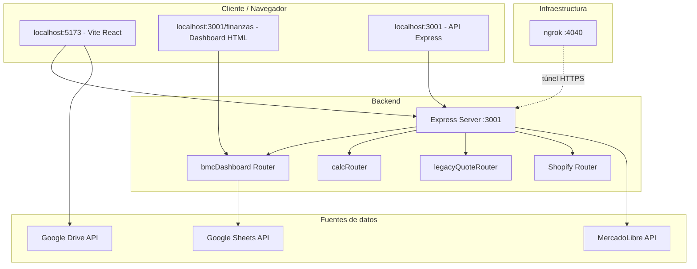
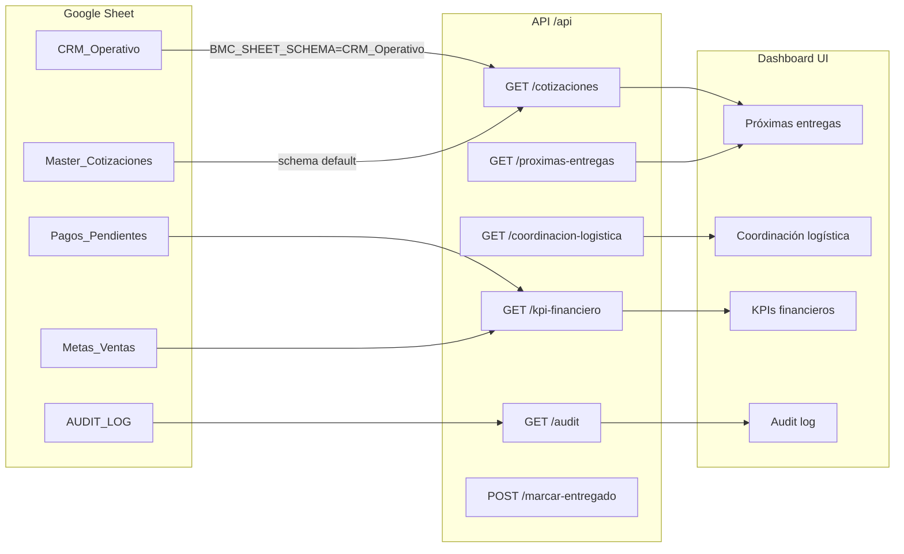
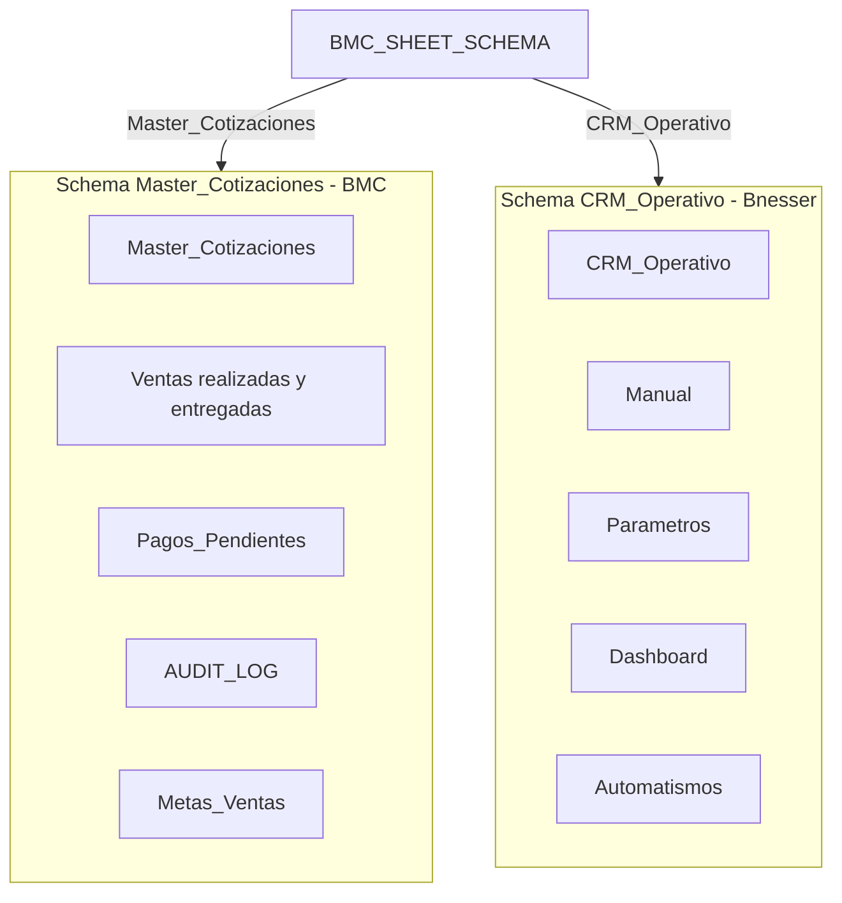
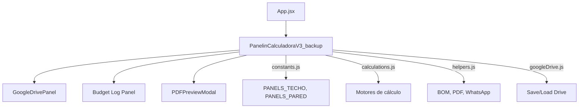
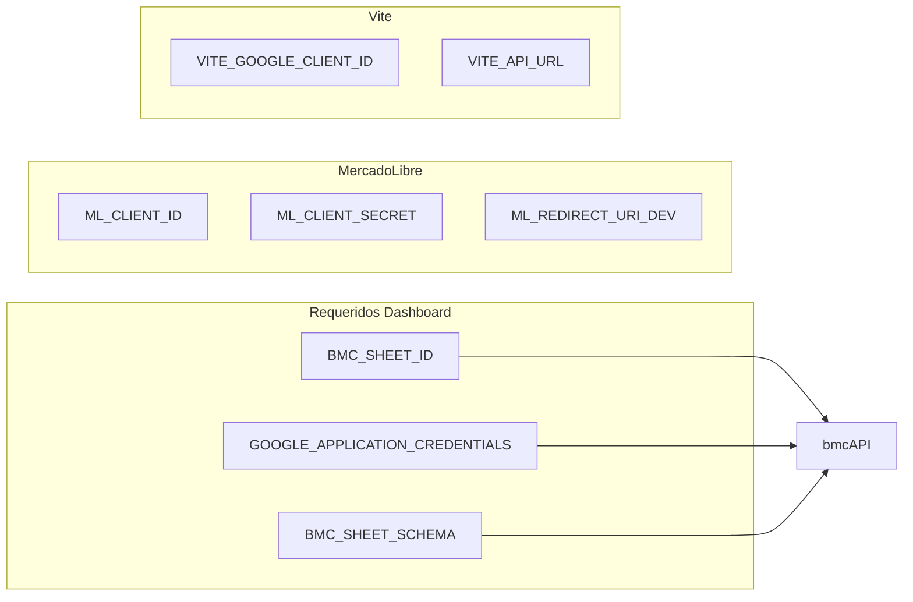

# BMC Dashboard — Mapa Visual de Configuración Total

**IA (secciones y navegación):** [IA.md](./IA.md). Este documento describe la arquitectura técnica; la IA define BMC Dashboard (producto), Finanzas, Operaciones, Cotizaciones, Ventas e Invoque Panelin.

## 1. Arquitectura general

---

## 2. Puertos y servicios

| Puerto | Servicio | Comando | URL |
|--------|----------|---------|-----|
| 5173 | Vite (React SPA) | `npm run dev` | http://localhost:5173 |
| 3001 | Express API | `npm run start:api` | http://localhost:3001 |
| 3001/finanzas | Sección Finanzas + Operaciones (static) | (servido por API) | http://localhost:3001/finanzas |
| 3849 | Servidor standalone (alternativo) | `npm run bmc-dashboard` | http://localhost:3849 |
| 4040 | ngrok inspector | (ngrok http 3001) | http://127.0.0.1:4040 |

Ver [NGROK-USAGE.md](../NGROK-USAGE.md) para URL, puerto, front (Vite) vs API (Express) y revisión de tráfico.

---

## 3. Flujo de datos — Dashboard

---

## 4. Esquema de Sheets (BMC vs CRM)

---

## 5. Componentes React (Vite 5173)

Canonical Calculadora: **PanelinCalculadoraV3_backup** (App.jsx). PanelinCalculadoraV3.jsx = alternate single-file build. Ver [IA.md](./IA.md).

---

## 6. Endpoints API (resumen)

| Método | Ruta | Fuente datos | Schema |
|--------|------|--------------|--------|
| GET | /health | — | — |
| GET | /api/cotizaciones | CRM_Operativo o Master_Cotizaciones | Ambos |
| GET | /api/proximas-entregas | Idem | Ambos |
| GET | /api/coordinacion-logistica | Idem | Ambos |
| GET | /api/kpi-financiero | Pagos_Pendientes, Metas_Ventas | Solo BMC |
| GET | /api/audit | AUDIT_LOG | Solo BMC |
| GET | /api/pagos-pendientes | Pagos_Pendientes | Solo BMC |
| GET | /api/metas-ventas | Metas_Ventas | Solo BMC |
| POST | /api/marcar-entregado | Master + Ventas realizadas | Solo BMC |

---

## 7. Configuración (.env)

---

## 8. Comandos de arranque

| Objetivo | Comando |
|----------|---------|
| Solo frontend | `npm run dev` |
| API + frontend | `npm run dev:full` |
| API + frontend + Evolution viewer | `./run_full_stack.sh` |
| Dashboard standalone | `npm run bmc-dashboard` |
| Setup completo + ngrok | `./run_dashboard_setup.sh` |

---

## 9. Mapeo CRM_Operativo → Dashboard

| Columna CRM | Columna normalizada |
|-------------|---------------------|
| ID | COTIZACION_ID |
| Fecha | FECHA_CREACION |
| Cliente | CLIENTE_NOMBRE |
| Teléfono | TELEFONO |
| Ubicación / Dirección | DIRECCION |
| Fecha próxima acción | FECHA_ENTREGA |
| Estado | ESTADO |
| Responsable | ASIGNADO_A |
| Consulta / Pedido | NOTAS |

---

## 10. Archivos clave

| Archivo | Rol |
|---------|-----|
| `server/index.js` | Express, rutas, /finanzas static |
| `server/routes/bmcDashboard.js` | API Sheets, mapeo CRM |
| `server/config.js` | bmcSheetSchema, env vars |
| `docs/bmc-dashboard-modernization/dashboard/` | HTML/CSS/JS del dashboard |
| `docs/bmc-dashboard-modernization/service-account.json` | Credenciales GCP |
| `src/components/PanelinCalculadoraV3_backup.jsx` | Calculadora + Drive + Log |
| `src/components/GoogleDrivePanel.jsx` | Panel Drive |
| `.env` | BMC_SHEET_ID, BMC_SHEET_SCHEMA, GOOGLE_APPLICATION_CREDENTIALS |
