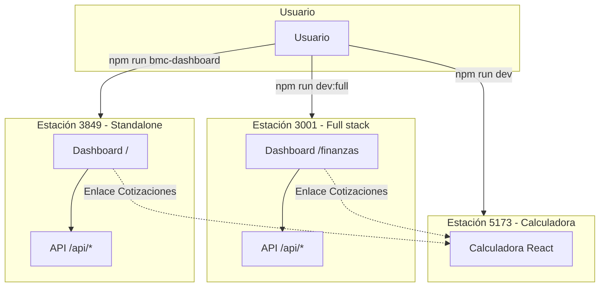

# Mapa visual — Estructura disponible para el usuario en cada estación

**Propósito:** Muestra qué ve y qué puede hacer el usuario en cada puerto/estación del BMC Dashboard.

---

## Resumen por estación

| Estación | Puerto | Comando | URL principal | Rol |
|----------|--------|---------|---------------|-----|
| **Full stack** | 3001 | `npm run start:api` o `npm run dev:full` | http://localhost:3001/finanzas | Dashboard + API + enlace a Calculadora |
| **Standalone** | 3849 | `npm run bmc-dashboard` | http://localhost:3849/ | Dashboard solo (sin API principal) |
| **Calculadora** | 5173 | `npm run dev` | http://localhost:5173 | Cotizador React (sin dashboard) |

---

## 1. Estación 3001 — Full stack (canónica)

```
http://localhost:3001
         │
         ├── GET / ──────────────► 302 redirect → /finanzas
         │
         └── /finanzas ───────────► Dashboard estático (HTML/CSS/JS)
                    │
                    ├── API: /api/* (bmcDashboard.js)
                    │   • Schema: CRM_Operativo o Master_Cotizaciones (BMC_SHEET_SCHEMA)
                    │
                    └── Enlace "Cotizaciones" ──► http://localhost:5173 (abre en nueva pestaña)
```

### Estructura visible para el usuario (3001/finanzas)

```
┌─────────────────────────────────────────────────────────────────────────────┐
│ HEADER (sticky)                                                              │
│  Nav: Inicio | Cotizaciones →5173 | Operaciones | Finanzas | Ventas | Invoque│
│  Logo: BMC Finanzas & Operaciones    [Actualizado HH:MM] [Actualizar]         │
└─────────────────────────────────────────────────────────────────────────────┘

┌─ BANNER (loading / sin datos / error) ──────────────────────────────────────┐
│  Solo visible cuando hay estado: cargando, vacío o no disponible             │
└─────────────────────────────────────────────────────────────────────────────┘

┌─ SECCIÓN 1: Resumen financiero ───────────────────────────────────────────────┐
│  [Moneda ▼]                                                                  │
│  ┌─────────────┐ ┌─────────────┐ ┌─────────────┐ ┌─────────────┐             │
│  │ Total       │ │ Esta       │ │ Próxima    │ │ Este mes   │             │
│  │ pendiente   │ │ semana     │ │ semana     │ │             │             │
│  └─────────────┘ └─────────────┘ └─────────────┘ └─────────────┘             │
└─────────────────────────────────────────────────────────────────────────────┘

┌─ SECCIÓN 2: Vencimientos próximos (trend) ──────────────────────────────────┐
│  Gráfico SVG inline · 8 fechas · filtrado por moneda                          │
└─────────────────────────────────────────────────────────────────────────────┘

┌─ SECCIÓN 3: Pagos pendientes (breakdown) ────────────────────────────────────┐
│  Tabla: Cliente | Pedido | Monto | Vencimiento | Estado                       │
└─────────────────────────────────────────────────────────────────────────────┘

┌─ SECCIÓN 4: Entregas y logística (#operaciones) ─────────────────────────────┐
│  ┌─ Próximas entregas ─────────────┐ ┌─ Vista previa mensaje ──────────────┐ │
│  │ Tabla + [Copiar WhatsApp]        │ │ [Copiar texto]                      │ │
│  │ Pedido | Cliente | Tel | Ubicación│ │ Mensaje listo para transportistas  │ │
│  └──────────────────────────────────┘ └─────────────────────────────────────┘ │
└─────────────────────────────────────────────────────────────────────────────┘

┌─ SECCIÓN 5: Metas de ventas ────────────────────────────────────────────────┐
│  Tabla: Período | Tipo | Meta | Notas                                         │
└─────────────────────────────────────────────────────────────────────────────┘

┌─ SECCIÓN 6: Audit log ──────────────────────────────────────────────────────┐
│  [Filtrar...] [Exportar CSV]                                                  │
│  Tabla: Fecha | Acción | Fila | Valor anterior | Valor nuevo | Razón | ...   │
└─────────────────────────────────────────────────────────────────────────────┘

┌─ SECCIÓN 7: Ventas 2.0 (#ventas) ────────────────────────────────────────────┐
│  Placeholder · "Próximamente."                                                 │
└─────────────────────────────────────────────────────────────────────────────┘

┌─ SECCIÓN 8: Invoque Panelin (#invoque) ───────────────────────────────────────┐
│  Placeholder · "Próximamente."                                                 │
└─────────────────────────────────────────────────────────────────────────────┘

┌─ FOOTER ────────────────────────────────────────────────────────────────────┐
│  Datos desde Google Sheets · Pagos_Pendientes · Metas_Ventas · ...            │
└─────────────────────────────────────────────────────────────────────────────┘
```

### Datos que consume (3001)

| Bloque UI | API | Fuente Sheets |
|-----------|-----|---------------|
| KPIs + trend + breakdown | GET /api/kpi-financiero | Pagos_Pendientes, Metas_Ventas |
| Entregas + WhatsApp | GET /api/proximas-entregas, /api/coordinacion-logistica | CRM_Operativo o Master_Cotizaciones |
| Metas | GET /api/metas-ventas | Metas_Ventas |
| Audit | GET /api/audit | AUDIT_LOG |

---

## 2. Estación 3849 — Standalone

```
http://localhost:3849
         │
         ├── GET / ──────────────► Dashboard (index.html)
         ├── GET /dashboard ─────► Idem
         ├── GET /dashboard/* ───► Assets (app.js, styles.css)
         │
         └── API: /api/* (sheets-api-server.js)
             • Schema fijo: Master_Cotizaciones (sin CRM_Operativo)
```

### Estructura visible para el usuario (3849)

**Misma UI** que 3001/finanzas. Mismo HTML, mismo layout, mismas secciones.

**Diferencias:**

| Aspecto | 3001 | 3849 |
|---------|------|------|
| Schema Sheets | CRM_Operativo o Master_Cotizaciones | Solo Master_Cotizaciones |
| Entregas / cotizaciones | Adaptado a CRM si schema=CRM_Operativo | Siempre Master_Cotizaciones |
| marcar-entregado | Sí (si schema BMC) | Sí |
| Enlace Cotizaciones | localhost:5173 | localhost:5173 (igual) |
| Uso típico | Desarrollo / producción | Dashboard aislado sin API principal |

---

## 3. Estación 5173 — Calculadora (Vite)

```
http://localhost:5173
         │
         └── React SPA ──────────► PanelinCalculadoraV3_backup
                    │
                    ├── Calculadora de cotización (paneles, BOM, PDF)
                    ├── GoogleDrivePanel (guardar/cargar en Drive)
                    ├── Budget Log Panel
                    └── PDFPreviewModal
```

### Estructura visible para el usuario (5173)

```
┌─────────────────────────────────────────────────────────────────────────────┐
│  CALCULADORA PANELIN                                                          │
│  (Sin nav del dashboard; es una app separada)                                 │
├─────────────────────────────────────────────────────────────────────────────┤
│  • Selector de paneles (techo, pared, etc.)                                  │
│  • Cantidades, dimensiones                                                    │
│  • Cálculo de BOM, precios                                                    │
│  • Panel Google Drive (guardar/cargar presupuestos)                           │
│  • Budget Log                                                                 │
│  • Vista previa PDF                                                           │
│  • Exportar / compartir                                                       │
└─────────────────────────────────────────────────────────────────────────────┘
```

**No incluye:** Finanzas, Operaciones, entregas, KPIs, audit. Solo cotización.

---

## 4. Diagrama de flujo entre estaciones



---

## 5. Tabla resumen: qué hay en cada estación

| Elemento | 3001/finanzas | 3849 | 5173 |
|----------|---------------|------|------|
| **Header + nav** | Sí | Sí | No (app distinta) |
| **Resumen financiero (KPIs)** | Sí | Sí | No |
| **Trend vencimientos** | Sí | Sí | No |
| **Pagos pendientes** | Sí | Sí | No |
| **Entregas y logística** | Sí | Sí | No |
| **Metas de ventas** | Sí | Sí | No |
| **Audit log** | Sí | Sí | No |
| **Ventas 2.0** | Placeholder | Placeholder | No |
| **Invoque Panelin** | Placeholder | Placeholder | No |
| **Calculadora** | Enlace externo → 5173 | Enlace externo → 5173 | App principal |
| **Google Drive** | No | No | Sí |
| **Budget Log** | No | No | Sí |

---

## 6. Cómo ver cada estación

| Estación | Comando | URL |
|----------|---------|-----|
| Full stack | `npm run start:api` | http://localhost:3001/finanzas |
| Standalone | `npm run bmc-dashboard` | http://localhost:3849/ |
| Calculadora | `npm run dev` | http://localhost:5173 |
| Todo junto | `npm run dev:full` | 3001 + 5173 en paralelo |

---

**Referencias:** [DASHBOARD-VISUAL-MAP.md](./DASHBOARD-VISUAL-MAP.md), [IA.md](./IA.md)
